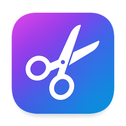
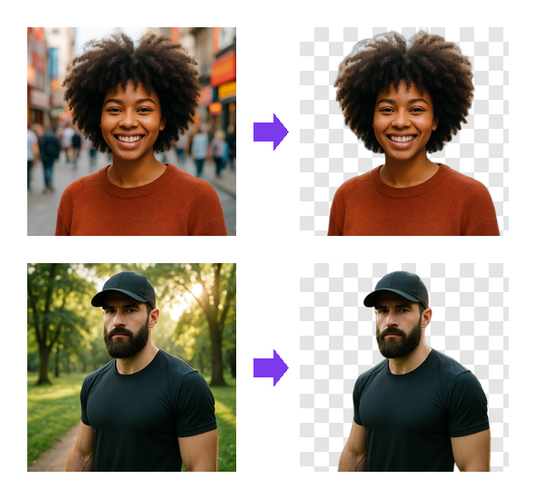
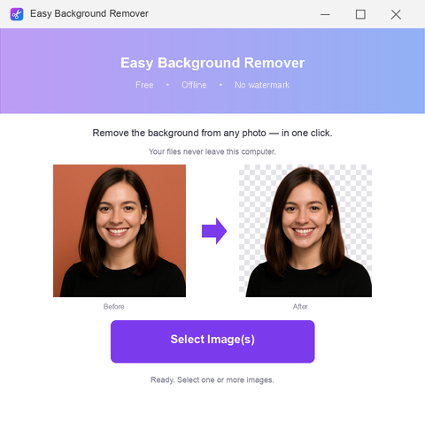
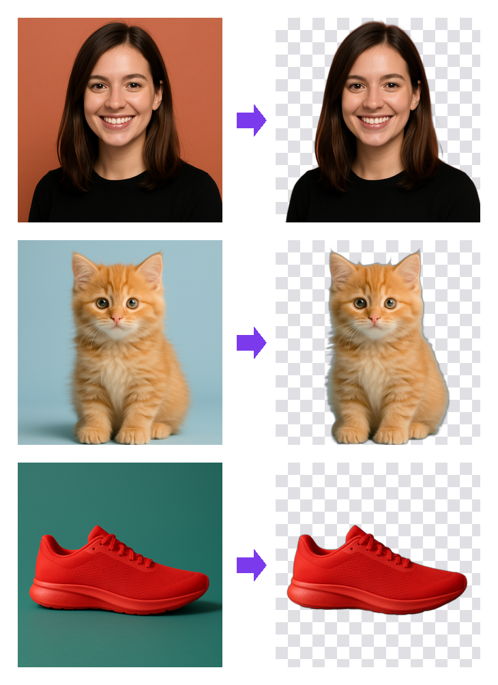
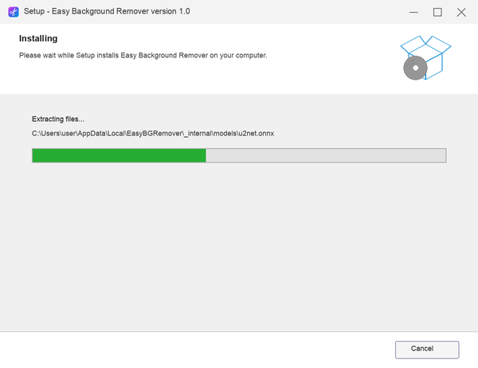
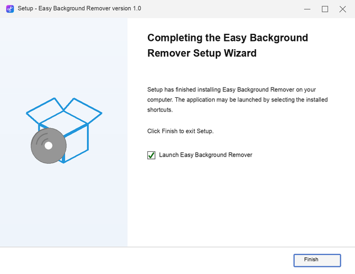

<div align="center">



# Easy Background Remover

### Remove image backgrounds in one click — **free, offline, no watermark.**




**[⬇️ Download for Windows](../../releases/latest)** &nbsp;·&nbsp; no account, no upload, no catch

🌐 **[Live demo & download → website](https://ix3wuhpgtpe.github.io/easy-background-remover/)**

</div>

---

## What is Easy Background Remover?

**Easy Background Remover** is a tiny, free desktop app for **Windows 10 and 11** that
erases the background from any photo and saves a clean, **transparent PNG** — in a single
click. No browser tabs, no uploading your pictures to a stranger's server, no monthly
subscription, and **no ugly watermark** slapped across your image.

Most "free" online background removers do one of three things: stamp a watermark on the
result, blur or lock the full-resolution download behind a paywall, or quietly upload your
private photos to their cloud. Easy Background Remover does **none** of that. Everything
runs **100% on your own computer**, powered by an open-source AI model (u2net). Your
images never leave your PC. It's free forever, with no limits on how many photos you
process.

Whether you're making a product photo for an online store, a clean profile picture, a
sticker, a meme, a Discord/Telegram emoji, or a transparent logo — drop the image in,
click once, and you're done.

## 🖥️ What it looks like

A clean, single-window app — no menus to learn, no clutter. Open it, click the button, done.

<div align="center">

</div>

## ✨ Features

- 🖱️ **One-click removal** — drop a photo, get a transparent PNG. That simple.
- 🗂️ **Batch mode** — select dozens of photos and process them all at once.
- 🚫 **No watermark, no limits, no account** — ever.
- 🔒 **100% offline & private** — images are processed locally and never uploaded.
- 🪶 **Lightweight** — runs on any Windows 10/11 PC. **No GPU required.**
- 🧠 **Real AI quality** — clean edges on hair, fur, and tricky outlines.
- 🆓 **Free & open-source** — MIT licensed. Inspect the code, build it yourself.

## 🖼️ See it in action

Real results — original on the left, AI cutout (transparent) on the right:

<div align="center">

</div>

> The checkered pattern just shows transparency — your exported PNG has a fully
> see-through background you can drop onto any color, banner, or design.

## ⚡ How it works — 3 steps

1. **Open the app** and click **“Select Image(s)”** (pick one photo or many).
2. The AI finds the main subject and **erases everything behind it**.
3. Your transparent **PNG** is saved next to the original — ready to use anywhere.

That's it. No learning curve, no settings to fiddle with.

## 🎯 Perfect for

- 🛍️ **Online sellers** — clean white/transparent product shots for eBay, Etsy, Amazon, Shopify
- 👤 **Profile & ID photos** — crisp avatars for LinkedIn, resumes, gaming profiles
- 🎨 **Designers & creators** — cut out subjects for thumbnails, posters, collages
- 😂 **Memes, stickers & emojis** — transparent cutouts for Discord, Telegram, WhatsApp
- 🖼️ **Logos & graphics** — strip the background off a logo in seconds

## ⬇️ Download

Two versions on the **[Releases](../../releases/latest)** page — pick what fits you:

| Version | Size | Quality | Best for |
|---|---|---|---|
| **Full** &nbsp;`EasyBGRemover_Setup.zip` | 186 MB | Maximum | Sharpest on fine hair, fur, tricky edges |
| **Lite** &nbsp;`EasyBGRemover_Lite_Setup.zip` | 55 MB | Near-identical (~98%) | Faster download / slower connections |

**Install (either version) — takes 20 seconds:**
1. Download the `.zip` and unzip it
2. Run the `..._Setup.exe` inside
3. A desktop icon appears — click it and you're ready ✂️

> The installer puts the app in your user folder, adds a single desktop shortcut, then
> **removes itself** — no leftover clutter. Both versions are 100% free, offline, and
> watermark-free.

### 📦 Installing is simple

A normal, clean Windows installer — no bundled junk, no toolbars, no sign-up. It finishes
in seconds and drops a single shortcut on your desktop.

<div align="center">

&nbsp;&nbsp;

</div>

## 🔒 Why offline matters

Free online background removers earn money in ways you don't see: they upload your photos
to their servers (where they may be stored or used to train models), add watermarks, throttle
quality, or charge for the full-resolution file. **Easy Background Remover flips that** —
the AI runs entirely on your machine, so your photos stay **private**, the output is
**full quality**, and there are **no limits**. Free, forever.

## ❓ FAQ

**Is it really free?**
Yes — completely free, no trial, no “pro” upsell, no watermark. Open-source under MIT.

**Do my photos get uploaded anywhere?**
No. Everything runs locally on your PC. The app works with your internet disconnected.

**Do I need a powerful PC or a graphics card?**
No. It runs on a normal Windows 10/11 laptop — **no GPU needed**.

**What format do I get?**
A transparent **PNG**, saved right next to your original image.

**Can it handle a lot of photos at once?**
Yes — use **batch mode** to process a whole folder of images in one go.

**Full vs Lite — which do I pick?**
Both produce great cutouts. **Full** is sharpest on fine details (hair, fur). **Lite** is
much smaller to download with ~98% of the quality — ideal on slow connections.

## 🛠️ Build from source

```bat
python -m venv venv
venv\Scripts\activate
pip install -r requirements.txt
:: place the u2net model at  models\u2net.onnx
:: https://github.com/danielgatis/rembg/releases/download/v0.0.0/u2net.onnx
build.bat
```
Powered by the open-source [u2net](https://github.com/xuebinqin/U-2-Net) model via
[onnxruntime](https://onnxruntime.ai/). The cutout pipeline mirrors
[rembg](https://github.com/danielgatis/rembg)'s default u2net path — no cloud, no telemetry.

## 📄 License
[MIT](LICENSE). The bundled u2net model is provided under its own license by its authors.

---
<div align="center"><sub>
background remover · remove background from image · remove background free · offline background remover ·
background remover no watermark · transparent PNG maker · background eraser · cut out image ·
batch background remover · free background remover for Windows · remove bg from photo offline
</sub></div>
